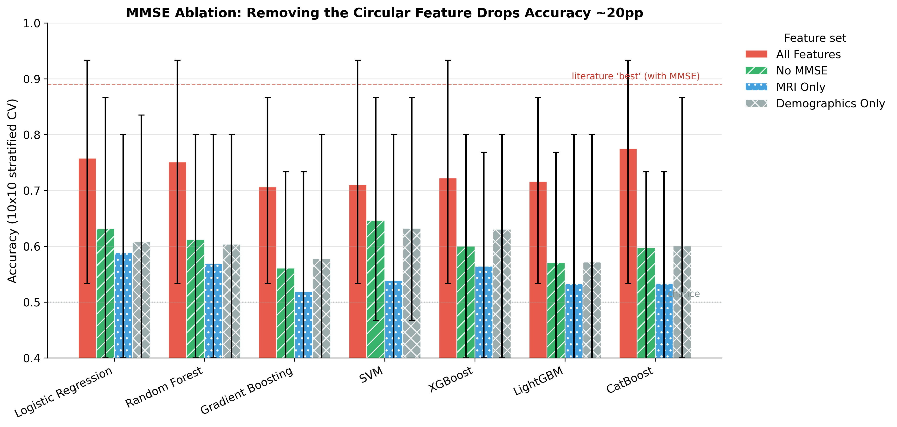
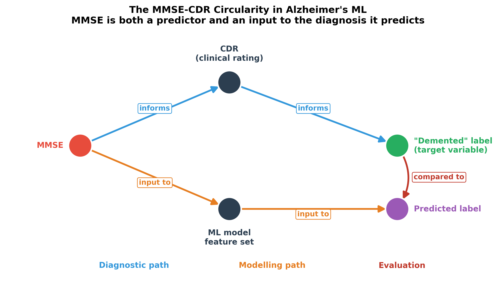
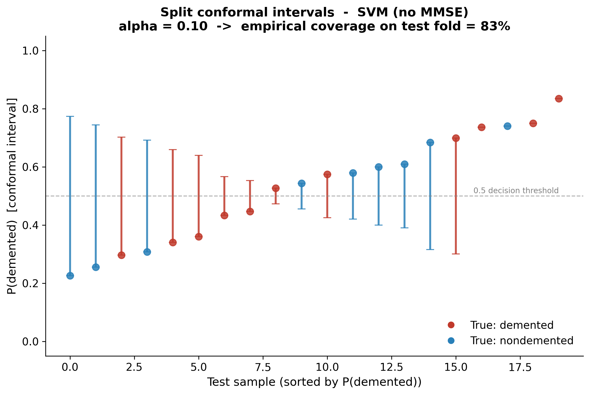
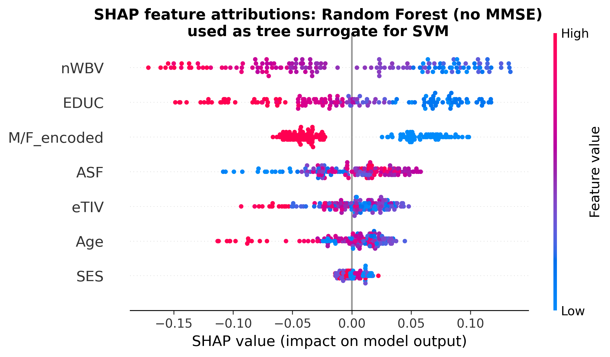

# Conformal Prediction for Alzheimer's Disease Classification: Honest Coverage and MMSE Circularity on OASIS-2

**Abiskar Acharya**

A multi-model audit of the OASIS-2 tabular benchmark, with split conformal prediction used both as a calibrated uncertainty method and as a probe for a circular feature.

<p align="center">
  
</p>

**Headline**

- Mean accuracy across seven classifier families on OASIS-2 with MMSE included: **73.4%**. Without MMSE: **60.3%**. The drop appears in every model, from 6.4 to 17.7 points.
- MRI morphometry alone (eTIV, nWBV, ASF) reaches **55.0%**, about 3 points above the 52% majority baseline.
- Repeated split conformal prediction on the best no-MMSE model holds nominal coverage at 90% target (**89.2% ± 1.2**, 50 splits) with a mean prediction set of **1.70 labels**, meaning roughly 30% of patients get a single-label answer and 70% get "not sure".
- Adding MMSE back shrinks the prediction sets (1.74 to 1.39 at 90% target) and raises single-label answers from 26% to 60.7%. The model looks more confident because the feature encodes the answer.
- At n_cal = 30, only α = 0.10 produces a usable threshold. The finite-sample correction saturates for α ≤ 0.05, so those levels are uninformative on this dataset.
- **Where this sits.** Ghiasi et al. (2026) remove CDR and keep MMSE; Rahman et al. (2026) keep MMSE by design. Neither measures what MMSE costs, and neither reports conformal coverage or set size. Section 2 sets out the three claims that remain.

---

## Abstract

Published and Kaggle-reported accuracy for Alzheimer's disease classification on the OASIS-2 dataset sits between 85% and 95%. This study measures how much of that number survives a change of evaluation protocol. Two methodological faults account for the gap. The first is the Mini-Mental State Examination (MMSE) used as a predictive feature while the label is derived from the Clinical Dementia Rating (CDR): the two instruments overlap heavily (Pearson r = -0.69 within the first visit of this cohort), so the model partly predicts the diagnosis from a test that formed it. The second is single-split evaluation on 150 subjects, where the test fold holds roughly 30 people and a different random seed moves accuracy by more than ten points. Under 10x10 repeated stratified cross-validation (100 folds), MMSE inflation is present in all seven model families, averaging 13.1 percentage points. The honest signal from demographics and gross MRI morphometrics on this cohort is 60.3%, and 55.0% from MRI features alone. Applying split conformal prediction to the best no-MMSE model gives empirical coverage close to the nominal target at α = 0.10 across 50 random splits, with prediction sets that widen exactly where the payoff is clinically relevant: patients near the decision boundary receive both labels, and the uncertain fraction falls when MMSE is reintroduced. The MMSE result is reported as a caution about this dataset's tabular benchmark rather than as a claim about the ceiling of Alzheimer's prediction. Two 2026 OASIS-2 benchmarks sit in adjacent ground: one removes CDR while retaining MMSE, the other retains MMSE by design to isolate the imaging increment. Neither prices MMSE, and neither reports conformal coverage or prediction-set size (Section 2).

**Keywords:** Alzheimer's disease, OASIS, MMSE circularity, conformal prediction, repeated cross-validation, small-sample evaluation

---

## 1. Why the 89% numbers do not hold

A single 80/20 split of 150 subjects puts about 30 people in the test set. A difference of two or three patients swings accuracy by seven to ten points, so two teams running the same pipeline with different seeds can report 79% and 92% and both be describing the same model. The per-fold evidence in this repository shows exactly that: with MMSE included, individual folds range from 53% to 93% around a mean of 73.4%, and the per-fold standard deviation sits near 10.5 points for every model family tested.

The second fault is more interesting because it is not a bug. MMSE is a 30-point cognitive screen. CDR is a clinical dementia rating assembled partly from cognitive testing. Within this cohort's first visits, MMSE averages 29.2 for CDR 0, 26.0 for CDR 0.5 and 23.0 for CDR 1.0, and the correlation between MMSE and CDR is -0.69. Feeding MMSE into a model whose label comes from CDR means the model reads part of the answer sheet. It is not train/test leakage, since no test row enters training, and that is precisely why it goes unnoticed. Ghiasi et al. (2026) remove CDR for exactly this reason and retain MMSE, which is the same fault left standing.

<p align="center">
  
</p>

## 2. Positioning against the 2026 OASIS-2 benchmarks

Two studies published this year work the same ground. Both were read in full before this repository was written up, and the difference is stated rather than left for a reader to discover.

**Ghiasi et al. (2026)**, *PLOS Digital Health* 5(5): e0001409, published 18 May 2026. Same dataset, all 373 sessions, a three-class task (nondemented / demented / converted), five classifier families. CDR is removed from the predictors and subject-grouped splitting is imposed; the paper's stated contribution is a leakage-free OASIS-2 benchmark. MMSE is deliberately retained as a readily collected clinical variable, and the paper's own SHAP analysis ranks MMSE the most influential feature in its SVC. There is no ablation that removes MMSE, no uncertainty quantification and no per-fold variance: the reported confusion matrices come from one held-out 20% partition of subjects.

**Rahman et al. (2026)**, Research Square preprint, posted 9 September 2026. Same dataset, all 373 records, and the more advanced of the two methodologically. The endpoint is the CDR rating recorded at each visit, `y = I{CDR > 0}`; CDR is excluded from predictors; nine classification procedures are tuned and selected inside nested participant-grouped folds. Pooled ROC-AUC 0.867 (participant-bootstrap 0.817 to 0.915), accuracy 0.786, sensitivity 0.689, specificity 0.864. The matched ablation asks what the three MRI variables add, and finds 0.035 ROC-AUC for logistic regression with tree-based intervals spanning zero. **MMSE is kept on purpose**: the authors state that because MMSE is among the predictors, the question is not whether demographics and MRI detect dementia on their own, but whether MRI adds anything once cognitive screening is already available. Their held-out XGBoost attributions are dominated by MMSE in all five folds.

**What the three share.** The eight-feature set in Section 3 (age, sex, education, SES, MMSE, eTIV, nWBV, ASF) is identical to the primary predictor set of Rahman et al. Both 2026 papers exclude CDR and so does this repository; both keep MMSE and so does the All Features condition here. Nothing in this repository contradicts either paper, and no score is directly comparable across the three. The units differ (one first visit per subject, n = 150, against 373 visits from 150 participants), the endpoints differ (converters folded into the demented class, against a three-class task and against a visit-level CDR threshold), and the metrics differ (accuracy under repeated stratified CV, against ROC-AUC pooled over grouped folds). Numbers here should not be set in a table beside theirs.

**What neither 2026 paper reports.** Three things, checked against both full texts rather than assumed.

1. **MMSE inflation as a measured quantity.** Ghiasi et al. remove CDR and keep MMSE as legitimate. Rahman et al. keep MMSE by design and vary the imaging instead. Neither reports the accuracy lost when MMSE is removed from the clinical set, per model family, as a result in its own right. Section 5.1 does: +13.1 points on average across seven families, range 6.4 to 17.7, read against an MMSE to CDR correlation of -0.69 and CDR-group MMSE means of 29.2 / 26.0 / 23.0. The 2026 finding that MMSE dominates attribution is the same phenomenon seen from the explainability side; the contribution here is to price it.

2. **Conformal prediction, and set size as a diagnostic.** Neither 2026 paper contains the word conformal, and neither reports a prediction set, a coverage guarantee or a singleton fraction. Rahman et al. report a Brier score and a five-bin calibration curve; Ghiasi et al. report neither. Section 5.4 reports coverage, set size and singleton fraction for the strongest no-MMSE model, and Table 4 carries the comparison that gives the method its use here: at an identical 90% target, the model reading MMSE returns a single label for 60.7% of patients and the model without it for 26.0%. Set size separates two pipelines that coverage alone calls identical, which makes it a detector for circular features rather than only a reporting device.

3. **Single-split instability as a reported result.** Ghiasi et al. evaluate on one held-out partition and report no fold variance. Rahman et al. show that the validation protocol moves the score (CatBoost at 0.913 row-level, 0.865 grouped, 0.840 grouped holdout), but not how far one draw of a fixed protocol moves. Section 5.3 reports 100 folds per cell (2.5th to 97.5th percentile 53 to 93 with MMSE) and the original 75/25 protocol across four seeds (logistic regression 65.5 to 79.3, random forest 72.4 to 86.2).

**What they do that this repository does not.** The endpoint here folds the 14 converters into the demented class, following the convention being audited. Rahman et al. replace the group label with the visit-level CDR threshold and audit the 20 records where the two definitions disagree; Ghiasi et al. keep three classes and treat conversion as its own task. Both endpoints are better, and Section 8 says so. Both papers also keep all 373 sessions under subject-grouped splitting, where this repository uses one first visit per subject, which removes subject overlap by construction but discards the longitudinal signal they retain. Rahman et al. additionally select the modelling procedure inside each training partition and attach participant-clustered bootstrap intervals; no procedure selection is attempted here.

The lane was claimed in May 2026 and extended in September 2026. What is left in it is narrower than the original claim and easier to defend: MMSE priced instead of assumed safe, conformal coverage and set size where neither competitor reports either, and a variance estimate for a single split. Those three are the contribution. The folded converters and the discarded later visits are the two places a reviewer should push hardest.

---

## 3. Data

OASIS-2 (Marcus et al., 2010) contains 373 MRI sessions from 150 subjects aged 60 to 98. This study uses each subject's first visit only.

| Item | Value |
|---|---|
| Subjects (first visit) | 150 |
| Sessions in the full longitudinal file | 373 |
| Visits per subject | mean 2.49, range 2 to 5 |
| Nondemented / Demented / Converted | 72 / 64 / 14 |
| Binary target after recoding | 72 nondemented, 78 demented (48% / 52%) |
| Missing values | SES missing for 8 subjects (5.3%), all in the demented group |
| SES imputation | median, which equals the mode (2) |

Converted subjects are folded into the demented class for the primary analysis, which follows the convention of the original work this study audits. Keeping them separate is the better design and is discussed in Section 8.

Four feature sets are compared.

| Feature set | Features | n | MMSE |
|---|---|---|---|
| All Features | M/F, Age, EDUC, SES, MMSE, eTIV, nWBV, ASF | 8 | yes |
| No MMSE | M/F, Age, EDUC, SES, eTIV, nWBV, ASF | 7 | no |
| MRI Only | eTIV, nWBV, ASF | 3 | no |
| Demographics Only | M/F, Age, EDUC, SES | 4 | no |

Two processed frames are written by the notebooks: `first_visit_processed.csv` (n=150, median imputation) used for every headline number here, and a drop-missing variant at n=142 used to check that the ranking of results does not depend on that choice. Raw OASIS CSVs are not committed.

## 4. Methods

### 4.1 Models

Seven classifiers from distinct families, all with deliberately conservative capacity for n=150 (parameters as committed in `src/config.py`).

| Model | Configuration |
|---|---|
| Logistic Regression | L2, C=1.0, lbfgs, max_iter=1000 |
| Random Forest | 100 trees, max_depth=5, min_samples_leaf=5 |
| Gradient Boosting | 100 trees, max_depth=3, lr=0.1, min_samples_leaf=5 |
| SVM | RBF kernel, C=1.0, probability=True |
| XGBoost | 100 trees, max_depth=3, lr=0.1, min_child_weight=5, subsample=0.8 |
| LightGBM | 100 trees, max_depth=3, lr=0.1, min_child_samples=5, subsample=0.8 |
| CatBoost | 100 iterations, depth=3, lr=0.1, min_data_in_leaf=5 |

Every model runs inside a pipeline with `StandardScaler` fitted on the training partition of each fold, so scaling statistics never cross the split.

### 4.2 Evaluation protocol

`RepeatedStratifiedKFold(n_splits=10, n_repeats=10, random_state=42)`, giving 100 fold estimates per model and feature set, 3,200 fold evaluations in total for the 7x4 grid. Two uncertainties are reported because they answer different questions: the 2.5th to 97.5th percentile of the 100 fold accuracies describes how much a single split on this dataset can move, and the Nadeau-Bengio corrected standard error on the mean describes how well the mean itself is pinned down. Recomputed from `cv_results.csv`, the Nadeau-Bengio SE runs 1.31 to 1.73 points across models (median 1.55), while the per-fold standard deviation is roughly 10 points. Both numbers matter: the mean is reasonably stable, an individual split is not.

### 4.3 MMSE ablation

For each model, accuracy with MMSE minus accuracy without it. The difference is the share of performance attributable to the circular feature rather than to imaging or demographics.

### 4.4 Conformal prediction

Split conformal prediction (Papadopoulos et al., 2002; Angelopoulos and Bates, 2022) with the nonconformity score `1 - p̂(true class)` and the finite-sample corrected quantile of Romano et al. (2019), `ceil((n_cal + 1)(1 - alpha)) / n_cal`, capped at 1.

Two pipelines exist in the code and they answer different questions.

The first, in `src/uncertainty.py::conformal_prediction`, derives the threshold from 5-fold cross-validated probabilities over all 150 subjects and measures coverage on those same subjects. It is the pipeline that produced `conformal_coverage.csv` and the numbers in notebook 06. Because calibration and evaluation share rows, it is optimistic, and its docstring says so.

The second, `repeated_split_conformal`, is the one to trust and the one this README reports. Each of 50 seeds splits the data 60/20/20 into train, calibration and test; the threshold comes from the 30 calibration points only, and coverage is measured on the 30 held-out test points. That yields a mean and standard error across seeds rather than a single number dressed up as a result.

The arithmetic of the correction matters at this sample size. With n_cal = 30, the corrected level is `ceil(31 * (1 - alpha)) / 30`. At α = 0.05 that is `ceil(29.45) / 30 = 1.0`, so the threshold becomes the largest calibration score and the procedure runs at its conservative corner. α = 0.01 lands on the same value, which is why the two levels produce identical sets in the results below. A non-saturated level needs α above 1/(n_cal+1) = 0.032, and a clean 99% target would need n_cal of at least 99.

### 4.5 Calibration, thresholds and stacking

Expected calibration error is computed from 5-fold cross-validated probabilities with 10 uniform bins. Decision thresholds are evaluated at 0.10, 0.50 and 0.90 to show what a screening posture and a confirmatory posture actually cost in sensitivity and specificity. Bayesian-style stacking weights come from a softmax over cross-validated log-likelihoods.

## 5. Results

### 5.1 The MMSE drop is universal

**Table 1. Mean accuracy by model and feature set, 10x10 stratified CV, n = 150**

| Model | All Features (MMSE) | No MMSE | MRI Only | Demographics Only | Inflation (pp) |
|---|---|---|---|---|---|
| Logistic Regression | 75.8 | 63.2 | 58.9 | 60.9 | +12.6 |
| Random Forest | 75.1 | 61.3 | 56.9 | 60.4 | +13.9 |
| Gradient Boosting | 70.7 | 56.1 | 51.9 | 57.8 | +14.5 |
| SVM | 71.1 | **64.7** | 53.9 | 63.3 | +6.4 |
| XGBoost | 72.3 | 60.1 | 56.5 | 63.1 | +12.2 |
| LightGBM | 71.7 | 57.1 | 53.3 | 57.2 | +14.6 |
| CatBoost | **77.5** | 59.8 | 53.4 | 60.1 | **+17.7** |
| **Mean** | **73.4** | **60.3** | **55.0** | **60.4** | **+13.1** |

The spread of the inflation term, 6.4 to 17.7 points, is worth reading carefully. SVM loses the least, and that is not because SVM is a better model. SVM's no-MMSE result (64.7%) is the highest in the table while its with-MMSE result (71.1%) is near the middle, so the gap narrows from both directions. Random Forest and CatBoost gain the most from the circular feature. The effect is a property of the feature set, not of any algorithm: seven families with different inductive biases all lose accuracy when the cognitive screen is removed, and they lose it in proportion to how much they were leaning on it.

### 5.2 What is actually left

Demographics alone (60.4%) slightly beat MRI alone (55.0%) and land within noise of the full no-MMSE set (60.3%). On this cohort, gross morphometry adds little on top of age, sex, education and SES. The MRI-only mean sits about 3 points above the 52% majority baseline, which is a fair description of the clinical value of eTIV, nWBV and ASF as committed here.

AUPRC tells the same story from the ranking side. With MMSE, mean AUPRC across models runs 83.8 to 87.9. Without it, the range is 66.9 to 77.3 with Logistic Regression on top. A model that ranks patients reasonably well but classifies them at 60% is a screening aid, not a diagnosis.

### 5.3 Per-fold spread: why one split says nothing

**Table 2. Fold accuracy distribution, 100 folds per cell (2.5th to 97.5th percentile, and observed extremes)**

| Model | All Features | No MMSE |
|---|---|---|
| Logistic Regression | 53 to 93 (40 to 100) | 40 to 87 (40 to 87) |
| Random Forest | 53 to 93 (47 to 93) | 40 to 80 (33 to 87) |
| Gradient Boosting | 53 to 87 (40 to 93) | 33 to 73 (33 to 80) |
| SVM | 53 to 93 (47 to 93) | 47 to 87 (33 to 93) |
| XGBoost | 53 to 93 (47 to 93) | 40 to 80 (33 to 87) |
| LightGBM | 53 to 87 (47 to 100) | 36 to 77 (20 to 80) |
| CatBoost | 53 to 93 (53 to 100) | 36 to 73 (33 to 80) |

A single fold can hit 100% or 20%. Repeating the original 75/25 protocol across four seeds moves Logistic Regression between 65.5% and 79.3% and Random Forest between 72.4% and 86.2%. Any OASIS result quoted without a confidence interval is a draw from that distribution, and the interval is usually wider than the effect being claimed.

### 5.4 Conformal prediction

**Table 3. Repeated split conformal, SVM on No MMSE, 50 splits, 30 calibration and 30 test points per split**

| α | Target | Empirical coverage (mean ± SE) | Observed range | Mean set size | Singleton fraction |
|---|---|---|---|---|---|
| 0.10 | 90% | **89.2% ± 1.2** | 63.3 to 100 | **1.70 ± 0.02** | 30.0% ± 2.4 |
| 0.05 | 95% | 97.4% ± 0.5 | 83.3 to 100 | 1.90 ± 0.01 | 10.1% ± 1.2 |
| 0.01 | 99% | identical to α = 0.05 | 83.3 to 100 | 1.90 ± 0.01 | 10.1% ± 1.2 |

Only the α = 0.10 row is a working result. Coverage lands 0.8 points below target with a standard error of 1.2, so the guarantee holds within sampling noise. Set size 1.70 means about 30% of patients receive one label and 70% receive both. Table 5 shows where the uncertainty sits: 41.5% of confidently-classified patients get a singleton set, and none of the near-boundary group (predicted probability between 0.3 and 0.7, n = 56) does.

The α = 0.05 and α = 0.01 rows are one row, not two. Across all 50 seeds the two levels give identical means, standard errors and observed ranges, because with n_cal = 30 the corrected quantile level saturates at 1.0 for both. The procedure stays valid, coverage is conservatively high at 97.4%, but the level carries no information: it is the maximum calibration score being used as a threshold. The 97.4% figure should not be read as a working 95% guarantee. It is the sound of a sample too small to support that resolution.

**Table 4. Prediction sets with and without MMSE (Gradient Boosting, notebook 06 pipeline, α = 0.10 and 0.05)**

| Target coverage | Feature set | Mean set size | Singleton fraction | Coverage achieved |
|---|---|---|---|---|
| 90% | No MMSE | 1.74 | 26.0% | 90.0% |
| 90% | All (with MMSE) | **1.39** | **60.7%** | 90.0% |
| 95% | No MMSE | 1.86 | 14.0% | 94.7% |
| 95% | All (with MMSE) | 1.55 | 44.7% | 94.7% |

This is the part of the study that generalises beyond OASIS. Two models reach the same 90% coverage. One of them answers with a single label for 61% of patients, the other for 26%. The confident one is the one reading MMSE. Conformal set size is therefore behaving as a detector for circular features: a feature that encodes the label buys apparent certainty without buying information. Anyone auditing a clinical model can compute this in a few lines and see the same signature.

<p align="center">
  
</p>

### 5.5 Which patients get an "I don't know"

**Table 5. Uncertainty by subgroup, α = 0.10, 90% target (notebook 06)**

| Subgroup | n | Mean set size | Singleton | Uncertain (both labels) |
|---|---|---|---|---|
| Nondemented | 72 | 1.81 | 19.4% | 80.6% |
| Demented | 78 | 1.68 | 32.1% | 67.9% |
| Near boundary, p in [0.3, 0.7] | 56 | 2.00 | 0.0% | 100% |
| Confident, p outside [0.3, 0.7] | 94 | 1.59 | 41.5% | 58.5% |

Nondemented patients receive wider sets than demented ones, which is the expected behaviour when the positive class is the one being modelled: the model is better at confirming dementia than at ruling it out. The near-boundary group is fully abstained on, and that is a feature rather than a failure. A model that returns "one of the two labels, and I can tell you which" for 41% of the confidently-classified cases and stays silent on the ambiguous middle is usable; a model that forces a binary answer for everyone is not.

### 5.6 Calibration and decision thresholds

Expected calibration error from 5-fold cross-validated probabilities: Random Forest 0.065, Logistic Regression 0.073, Gradient Boosting 0.235. The boosting model is confident and wrong in a way that ECE catches immediately, which is a good argument for never shipping a threshold on an uncalibrated tree ensemble.

**Table 6. Decision thresholds (Gradient Boosting, No MMSE)**

| Posture | Threshold | Sensitivity | Specificity | PPV | NPV | Accuracy |
|---|---|---|---|---|---|---|
| Screening, catch cases | 0.10 | 93.6% | 8.3% | 52.5% | 54.5% | 52.7% |
| Balanced default | 0.50 | 56.4% | 52.8% | 56.4% | 52.8% | 54.7% |
| Confirmatory, avoid false alarms | 0.90 | 17.9% | 90.3% | 66.7% | 50.4% | 52.7% |

Setting the threshold at 0.10 catches 94% of dementia cases at the cost of almost every negative, and the positive predictive value stays at 52%, which is the class balance. The confirmatory setting raises PPV to 67% and misses 82% of cases. On a cohort where dementia prevalence is 52%, screening value is close to nil in either posture. Real screening populations run at 5% to 8% prevalence, and the same model there would be dominated by false positives.

Stacking weights back the simpler model: Logistic Regression takes 99.4%, SVM 0.5%, Random Forest 0.1% and Gradient Boosting effectively zero. On this dataset the ensemble vote is a vote for the linear model.

### 5.7 Does the missing-data choice matter?

**Table 7. Median imputation (n = 150) minus drop-missing (n = 142), percentage points**

| Model | All Features | No MMSE | MRI Only | Demographics Only |
|---|---|---|---|---|
| Logistic Regression | +1.2 | +0.8 | -0.5 | +4.3 |
| Random Forest | -0.3 | +0.8 | +0.2 | +3.2 |
| Gradient Boosting | -0.3 | +1.2 | -2.5 | +2.8 |
| SVM | +0.5 | +2.8 | -2.7 | +3.5 |

The headline comparison survives either choice: no-MMSE accuracy sits 11 to 17 points below the with-MMSE figure in both frames. The one cell that moves meaningfully is demographics-only, where adding eight demented subjects is worth 2.8 to 4.3 points, and that is a statement about how thin the signal is rather than about the imputation.

### 5.8 Feature attribution

`fig3_shap_beeswarm.png` is a SHAP beeswarm for a Random Forest fitted on the no-MMSE features. The best no-MMSE model is SVM (64.7%), which has no tree structure, so the figure uses the strongest tree model in that condition as a surrogate and labels itself as such. The committed correlation analysis puts MMSE at r = -0.53 with the label, ahead of nWBV at -0.27 and EDUC at -0.21. No numeric SHAP table is committed; the attribution figures come from notebook 07 and the ranking claims should be read from the figures, not quoted as numbers.

<p align="center">
  
</p>

## 6. Discussion

The benchmark number for OASIS-2 tabular classification is 73.4% under repeated cross-validation when MMSE is included, and 60.3% when it is not. Neither figure is 89%. The difference between the published range and 73.4% is single-split variance, and the difference between 73.4% and 60.3% is one circular feature. Both 2026 benchmarks in Section 2 reached their conclusions with MMSE in the predictor set, one of them while calling the result leakage-free. Read against them, the 13.1-point inflation is not a criticism of either pipeline but the number missing from the pair.

The conformal results change how the second number should be read. 60.3% accuracy sounds like a weak model. The set-valued view is more generous and more useful: at 90% target coverage the model commits to a single label for 30% of patients and abstains on the rest, and the abstentions concentrate exactly where a clinician would want a second opinion. A model with modest accuracy and honest uncertainty is deployable in a triage role. A model with 89% accuracy and no uncertainty estimate is not, particularly when the 89% depends on a feature the clinician already has.

There is a design lesson in Table 4. Two pipelines, same data, same 90% coverage, set sizes 1.74 and 1.39. Reporting coverage alone would have hidden the difference, since coverage is guaranteed by construction once the procedure is valid. Set size and singleton fraction are where the information lives, and any study that reports coverage without set size has reported the part of conformal prediction that is true by definition.

## 7. Limitations

The sample is 150 subjects from one centre and one scanner, aged 60 to 98. Everything above describes this cohort, these features and this protocol, and nothing more. OASIS-2 is also unusually balanced at 52% demented, which flatters PPV in a way that a 6% prevalence screening population would not.

The feature set is gross morphometry (eTIV, nWBV, ASF) plus demographics. No cortical thickness, no hippocampal subfields, no APOE genotype, no amyloid or tau. The finding is "these MRI-derived features deliver about 60% on this cohort", not "MRI cannot predict Alzheimer's disease".

Conformal coverage here is marginal, not conditional. The method guarantees 90% coverage on average across the population, and the subgroup table shows it does not deliver 90% for every subgroup. Auditing that gap properly needs more data than 150 subjects can supply.

The 14 converters are folded into the demented class. That is the convention being audited, but it discards the most clinically valuable subgroup in the file, and their trajectories are only described, not modelled, in the committed figures.

Coverage estimates come from splits with 30 calibration and 30 test points, so per-seed coverage ranges from 63% to 100% at α = 0.10 even though the mean behaves. The α = 0.05 level carries no information at this sample size. TabPFN was planned for the model panel and excluded: a single CPU inference pass stalled repeatedly during the build, so the panel is seven models, not eight, and nothing here rests on its absence.

## 8. Next steps

The most valuable single change is external validation. `scripts/replicate_oasis3.py` runs the identical 10x10 audit against OASIS-3, which has more than 1,000 subjects. Register at oasis-brains.org, point the script at the demographics plus FreeSurfer table, and it prints MMSE inflation per model next to the 13.1-point OASIS-2 figure. A replication within about 3 points of that average would move this from a single-cohort audit to a generalisable finding.

After that, in rough order of value: treat the converters as a third class or as a time-to-event target instead of folding them in; report subgroup-conditional coverage rather than marginal; and add a second cohort with feature-level overlap (ADNI, AIBL) so the ablation is not tied to one schema.

## 9. Reproducing the results

```bash
git clone <this-repo> && cd alzheimers-prediction
python -m venv env && source env/bin/activate
pip install -r requirements.txt
```

OASIS data is not redistributed. Register at [oasis-brains.org](https://www.oasis-brains.org/) and download the OASIS-2 longitudinal file into `data/raw/oasis_longitudinal.csv`.

```bash
python scripts/build_results.py    # mmse_ablation.csv, cv_results.csv, conformal_coverage.csv
python scripts/build_figures.py    # the five fig*.png files
jupyter lab notebooks/             # 01 to 08 in order, for the full walkthrough
streamlit run dashboard/app.py     # interactive version of the same comparisons
```

## 10. Repository layout

```
alzheimers-prediction/
├── notebooks/     01 data exploration, 02 preprocessing, 03 baseline models and MMSE
│                  ablation, 04 advanced models, 05 longitudinal, 06 uncertainty and
│                  conformal, 07 explainability, 08 cross-validation audit
├── src/           config.py (features, model params, seeds), data_loading.py,
│                  feature_engineering.py, evaluation.py, uncertainty.py, visualization.py
├── scripts/       build_results.py, build_figures.py, replicate_oasis3.py
├── dashboard/     app.py, Streamlit
├── results/       figures/ and tables/, both committed
└── data/          raw/ and processed/, neither committed
```

`src/uncertainty.py` holds the conformal implementations, including the docstring explaining why `conformal_prediction` is optimistic and `repeated_split_conformal` is the honest one.

## 11. Results file index

| File | What it holds |
|---|---|
| `tables/mmse_ablation.csv` | Table 1 source: 28 model and feature-set cells, 100 folds each |
| `tables/cv_results.csv` | 3,200 per-fold accuracies and AUPRCs behind Table 2 |
| `tables/conformal_coverage_repeated.csv` | Per-seed output, 50 seeds x 3 α levels, train/cal/test |
| `tables/conformal_coverage_repeated_summary.csv` | Table 3 source: mean, SE, min, max per α |
| `tables/conformal_coverage.csv` | The optimistic in-sample pipeline, SVM, n_cal = 150 |
| `tables/conformal_prediction_summary.csv` | Notebook 06 single-shot conformal, Gradient Boosting |
| `tables/conformal_mmse_comparison.csv` | Table 4 source: set sizes with and without MMSE |
| `tables/uncertainty_by_subgroup.csv` | Table 5 source |
| `tables/calibration_ece.csv` | Expected calibration error per model |
| `tables/clinical_decision_thresholds.csv` | Table 6 source |
| `tables/bayesian_stacking_weights.csv` | Cross-validated log-likelihood weights |
| `tables/mmse_ablation_baseline.csv`, `tables/mmse_ablation_median_impute.csv` | Table 7 source, drop-missing and median frames |
| `tables/single_split_vs_cv.csv` | Single-split against cross-validated accuracy, four models |

## 12. References

- Angelopoulos, A. N., and Bates, S. (2022). A gentle introduction to conformal prediction and distribution-free uncertainty quantification. arXiv:2107.07511.
- Bansal, D., Chhikara, R., Khanna, K., and Gupta, P. (2018). Comparative analysis of various machine learning algorithms for detecting dementia. Procedia Computer Science, 132, 1497-1502.
- Battineni, G., Chintalapudi, N., and Amenta, F. (2020). Late-life Alzheimer's disease detection using pruned decision trees and machine learning models. International Journal of Hybrid Intelligent Systems, 16(3), 167-177.
- Battineni, G., Hossain, M. A., Chintalapudi, N., Traini, E., Dhulipalla, V. R., Ramasamy, M., and Amenta, F. (2021). Improved Alzheimer's disease detection by MRI using multimodal machine learning algorithms. Diagnostics, 11(11), 2103.
- Ghiasi, M. M., Falck, R. S., Liu-Ambrose, T., and Tam, R. C. (2026). Explainable machine learning for predicting longitudinal dementia status: establishing a leakage-free benchmark. PLOS Digital Health, 5(5), e0001409. https://doi.org/10.1371/journal.pdig.0001409
- Marcus, D. S., Fotenos, A. F., Csernansky, J. G., Morris, J. C., and Buckner, R. L. (2010). Open access series of imaging studies: longitudinal MRI data in nondemented and demented older adults. Journal of Cognitive Neuroscience, 22(12), 2677-2684.
- Morris, J. C. (1993). The Clinical Dementia Rating (CDR): current version and scoring rules. Neurology, 43(11), 2412-2414.
- Olsson, H., Kartasalo, K., Mulliqi, N., et al. (2022). Estimating diagnostic uncertainty in artificial intelligence assisted pathology using conformal prediction. Nature Communications, 13, 7761.
- Papadopoulos, H., Proedrou, K., Vovk, V., and Gammerman, A. (2002). Inductive confidence machines for regression. ECML 2002.
- Perneczky, R., Wagenpfeil, S., Komossa, K., Grimmer, T., Diehl, J., and Kurz, A. (2006). Mapping scores onto stages: mini-mental state examination and clinical dementia rating. American Journal of Geriatric Psychiatry, 14(2), 139-144.
- Rahman, M. H., Hasan, M. J., Hossain, M. S., and Ovi, M. S. I. (2026). How reliable and explainable are machine learning models for dementia detection? A leakage-aware evaluation. Research Square preprint. https://doi.org/10.21203/rs.3.rs-10967756/v1
- Romano, Y., Sesia, M., and Candès, E. (2019). Classification with valid and adaptive coverage. NeurIPS 32.
- Tombaugh, T. N., and McIntyre, N. J. (1992). The mini-mental state examination: a comprehensive review. Journal of the American Geriatrics Society, 40(9), 922-935.
- Uzo, I. U., et al. (2026). Conformal uncertainty quantification for multi-class prediction of Alzheimer's disease stages. SSRN preprint 6076856. https://doi.org/10.2139/ssrn.6076856
- Varoquaux, G. (2018). Cross-validation failure: small sample sizes lead to large error bars. NeuroImage, 180, 68-77.
- Vovk, V., Gammerman, A., and Shafer, G. (2005). Algorithmic learning in a random world. Springer.
- Young, V. M., Gates, S., Garcia, L. Y., and Salardini, A. (2025). Data leakage in deep learning for Alzheimer's disease diagnosis: a scoping review of methodological rigor and performance inflation. Diagnostics, 15(18), 2348. https://doi.org/10.3390/diagnostics15182348

## 13. Citation and licence

```bibtex
@misc{acharya_alzheimers_conformal,
  title  = {Conformal Prediction for Alzheimer's Disease Classification:
            Honest Coverage and MMSE Circularity on OASIS-2},
  author = {Acharya, Abiskar},
  year   = {2026},
  note   = {GitHub repository}
}
```

MIT licence, see `LICENSE`.
